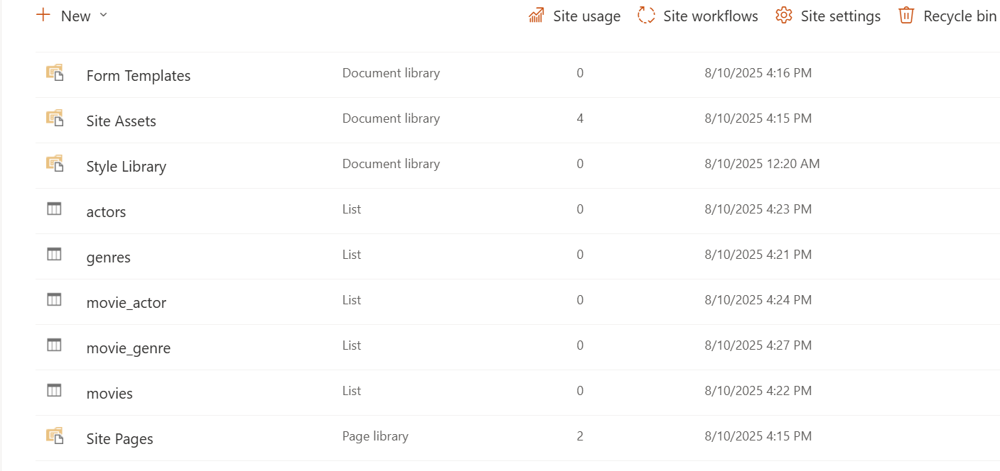
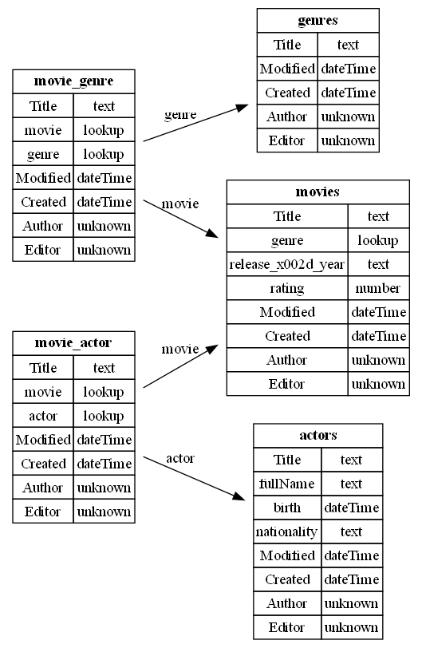

## 🗂️ SharePoint Schema Generator
This project is a Python console application that connects to Microsoft Graph API to fetch SharePoint lists and columns and automatically generates a UML-Like diagram of the data schema.

It was inspired by a real-world challenge when building a PowerApps application with SharePoint as a database, making it easier to visualize list relationships and improve documentation.

### ✨ Features
* Connects to Microsoft Graph API using a provided access token and site ID.
* Scans all SharePoint lists (excluding system lists).
* Detects lookup columns and builds relationship diagrams.
* Generates a UML diagram in PNG format.
* CLI-based → simple to run.

### 📦 Requirements
* Python 
* Graphviz installed
* Python packages: 

```
uv add requests graphiz 
```
### ⚙️ Installing Graphviz
1. Download and install Graphviz https://graphviz.gitlab.io/download/
2. make Graphviz available to Python by setting the PATH.
3. If you're unable to modify environment variables permanently, you can use Graphviz in your current PowerShell session by running:
```
$env:PATH += ";C:\path_to_graphviz_bin"
```

### 🚀 Usage
Run from the console : 

```
uv run main.py --token "YOUR_ACCESS_TOKEN" --site-id "YOUR_SITE_ID" 
```
### 🖼️ Example

### SharePoint Site Content
Below is an example of the site content the tool scans:



### Generated UML Diagram
And here’s the output diagram generated by the tool:


